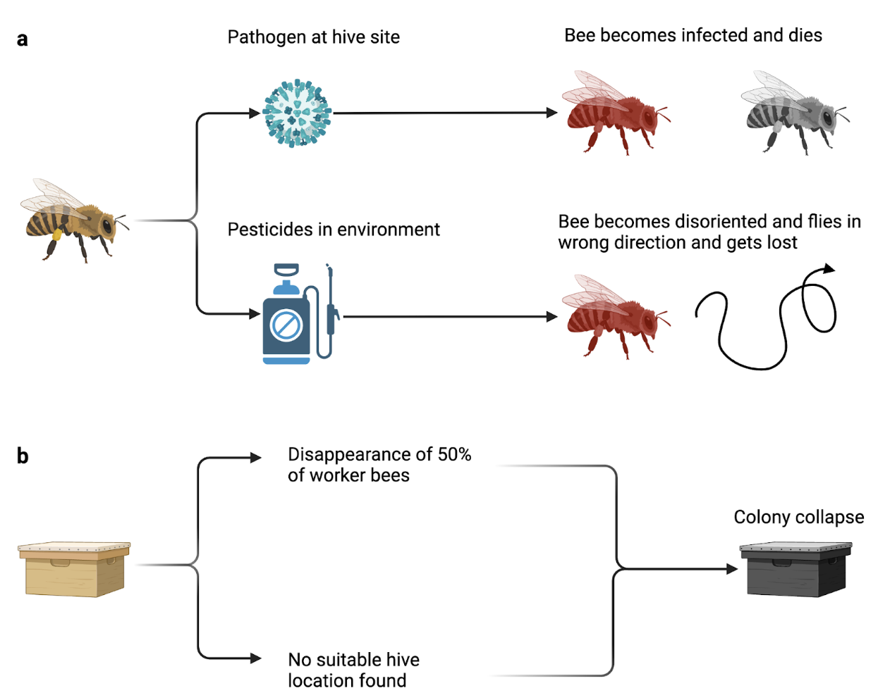

# Simulating Colony Collapse Disorder in Honeybee Colonies with NetLogo



## Overview

This project models Colony Collapse Disorder (CCD) in honeybee colonies using **NetLogo**. By enhancing the BeeSmart Hive Finding model, it simulates environmental stressors like pesticide pollution and pathogen-infected hives to explore their effects on colony health and survival.

### Key Features

- Agent-based simulation of honeybee behaviors.
- Adjustable environmental stress parameters.
- Visual tools for analyzing colony dynamics.
- Insights into feedback loops and self-organization.

## Repository Contents

- **`CCD_Simulation.nlogo`**: NetLogo model file.
- **`On_the_Nature_of_the_Honeybee_Report.pdf`**: Detailed report with methodology and results.
- **`FIG1.png`**: Overview of simulation mechanisms.

## Getting Started

1. **Install NetLogo** from [NetLogo's website](https://ccl.northwestern.edu/netlogo/).
2. Clone this repository:  
   ```bash
   git clone https://github.com/yourusername/CCD_Simulation.git
    ```
3.	Open CCD_Simulation.nlogo in NetLogo, configure parameters, and start the simulation.